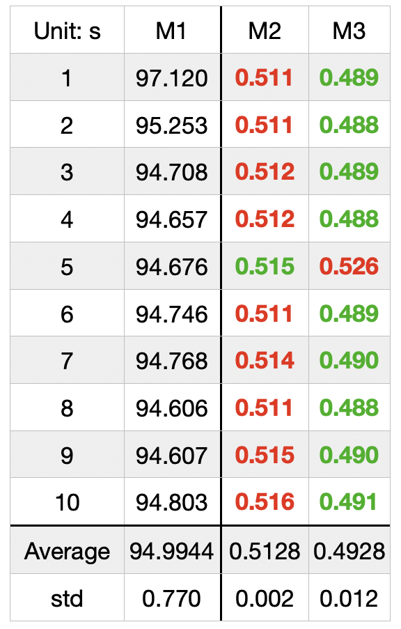
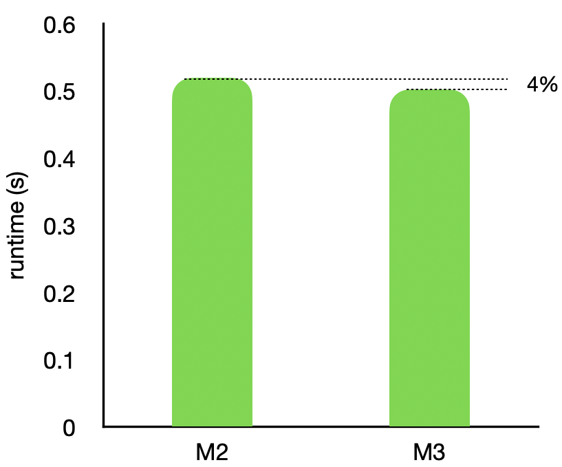

# Applying Work Stealing in Distributed Ray Tracing

_Figure 1. A 4K image generated in our project._

## I. Motivation

One barrier in improving the performance of ray tracing is its unbalanced workloads among each pixel. The most famous method to solve this problem is BVH (Bounding Volume Hierarchy) since it traverses the tree efficiently. However there is another method to solve this uneven workloads problem - **work stealing**. In this project, we want to figure out whether work stealing is appropriate for this kind of problem and we want to learn how to implement work stealing in practice.

## II. Implementation (Machine: GTX 960)

### 1. Ray tracing library
We use the basic ray tracing library from here. In this library, each thread is responsible for one pixel and it works on only one ray generated from camera through each pixel on the image.

### 2. Scene
We generate 21 spheres, one light source, one floor and one mirror in our scene. The light source emits the light from the top to the floor and the mirror is behind all the spheres vertically.

### 3. Unbalanced works
A work, or a task, means a self-defined data type that consists of the ray and the corresponding pixel index. For each pixel, we add 10 random rays emitted from the position of the camera through the position of that pixel, as **Figure 2** shown below. The random distribution of rays is used to get the effect of antialiasing. For each ray, when it hits mirror surface object, we generate a new ray based on the law of reflection from the hitting point. In this case, different rays have different depth (different number of reflections) when it goes through the scene so that every pixel has different workloads.

    

_Figure 2. A brief schematic diagram of rays pass through a pixel._

### 4. Implementation of work stealing 
In order to let threads steal works from other threads in the same block, we implement a task queue in the shared memory for each block that contains 16x16 threads. In our implementation, each thread will assign 40 to 50% of its tasks to the queue in the beginning, then do its own left works. At last, when a thread finishes its whole works faster than its peers, it can grab extra tasks from the queue until the queue is empty.

## Results
### 1. Anti aliasing effect
We implement anti aliasing by adding more random rays to each pixel, as shown in **Figure 3**. To create an unbalanced workloads environment, applying anti aliasing is useful since one single pixel can emit different angle of rays, which may cause different number of reflection for each rays. For example, some rays may hit directly on the mirror and reflect to nothing, and some other rays may hit multiple objects before they stops. These differences can result from randomly created rays but cause highly distinct outcomes.

    

_Figure 3. The image on the left is the original image and the image on the right apply antialiasing respectively._

### 2. Performance
We estimate the runtime of three method: CPU, GPU without work stealing, and GPU with work stealing. We use M1 to M3 to represent each method as listed below:

- M1: CPU
- M2: GPU without work stealing
- M3: GPU with work stealing

To measure their runtime, we generate 10 images with 1920x1080 pixels for each method and record their results in Table 1. From **Table 1**, M3 get around 190.19 times faster compared with M1 and 4% improvement compared with M2, as shown in **Figure 4**. Although M3 is faster than the other method, in some cases, M3 is slower than M2. One of our fastest result is shown in **Figure 5**, which achieves 0.484 s for one image although its shared memory usage is different with our last version.

|                           |                         |
|---------------------------|-------------------------|
|  |  |
|
 _Table 1. The runtimes of the three method._ 
 | 
 _Figure 4. The comparison between M2 and M3_ 
|

_Figure 5. The fastest result. “(w/)” means “with work stealing” and “(w/o)” means “ without work stealing”_

### 3. Work Stealing
We represent how work stealing performs in our method as shown in **Figure 6**. The brighter the pixel means the more number of works is stolen by a thread for that pixel. In **Figure 6**, we can see some patterns:

- P1: Work stealing happens more frequently on the edges
- P2: Work stealing happens more frequently on the surface of the sphere that its coefficient has higher value in reflection.

The reason of P1 in our point of view may cause by the wide angle reflection, so the rays on the edge won’t reflect as much times as others. Therefore, they can finish their works faster and steal others’ works.

_Figure 6. The distribution of number of stolen works among threads. The brighter pixels mean the corresponding threads steal more works than others._

If we look closer, as shown in **Figure 7**, we can recognize that many “sticks” stack together horizontally and all of them are 16 pixel wide. This reveals each column has multiple blocks, which have 16x16 threads, stack together. If we look even closer, like **Figure 8**, the “sticks” in **Figure 7** are actually a warp, which is composed with 2x16 threads. Therefore, every pixels in one “stick” has the same color because they are in the same warp.

|                          |                          |
|            -             |            -             |
  |  

 _Figure 7. A zoom-in version of Figure 6. Each column is 16 pixels wide, which matches the width of a 16x16 thread block._ 
 | 
 _Figure 8. A zoom-in version of Figure 7. Each row contains 2x16 pixels, which matches the number of threads in a warp. This figure represents a block since it has 16x16 pixels._ 

## IV. Discussion

### 1. An issue due to the setter
When the first time we implemented the work stealing in our algorithm, the generated image looked like the right image in **Figure 9**. Since multiple threads will steal works from the same pixel, when they finish the stolen works, they all try to write their results in a pixel. In this case, a typically setter problem - **multiple writes at the same time in the same place, the machine will store one of them eventually**. Therefore, that’s why in **Figure 9**, although the thread finish its works, the image still shows it doesn’t solve this problem. We apply **atomicAdd** for the write instructions and solve this issue.

_Figure 9. The left image shows the pixels don’t fully complete its works in white color. The right one is the result. We can see some unnormal bars randomly lies among the edge of the spheres._

### 2. Bottlenecks
In our implementation, our method can only steal 40 to 50% of works among 256 threads (16x16) since the limitation of the maximum size of the shared memory a block can have is 48K in GTX 960. Eventually, we use 46080 Bytes for each block. If shared memory can be larger, we can have more flexibility to let all of threads fully load in most of time during the runtime. Or we can place all of tasks in the global memory and read a chunk of works per access for a block to allow work stealing among blocks to improve the performance.

### 3. Unbalanced workloads
According to **Figure 6**, we can find that the workloads is not very uneven. There are still many pixels do its own works only (the flat gray region in the figure). In our opinion, it results from the lack of refraction. In the scenario including refraction, rays will generate more rays when they hit transparent objects, which make unbalanced workloads more severe. Therefore, work stealing could work more well if our scene included refraction. 

Another point is that the ray tracing library only has simple reflection for rays to interact with objects. Although it includes the diffusion in the coefficient, it doesn’t diffuse the rays randomly. With this restriction, the unbalance of workloads is mainly caused by the different times of the reflections in each rays.

### 4. Tradeoff for applying work stealing
The reason we implement work stealing is to balance the unbalanced workloads, and according to the result we get, we slightly win this competition eventually. But there are downsides for applying this method as well. 

First, since we allow threads to steal works, the scenario mentioned in the **subsection 1** (An issue due to the setter) exists. Therefore, we have to add atomic operations, which loses a lot of improvements made by work stealing. 

Second, we need extra data access (write and read) to the shared memory, which is slower than just accessing works directly in the register. 

Although there are some downsides and restrictions for applying work stealing, it still improve the runtime in the end. Therefore, we believe work stealing can speed up the processing time of ray tracing and will work better if the points mentioned in subsection 3 are satisfied. 